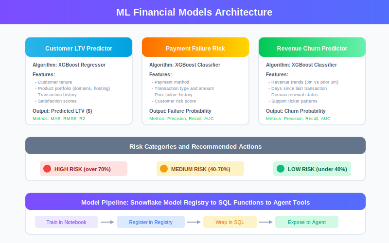
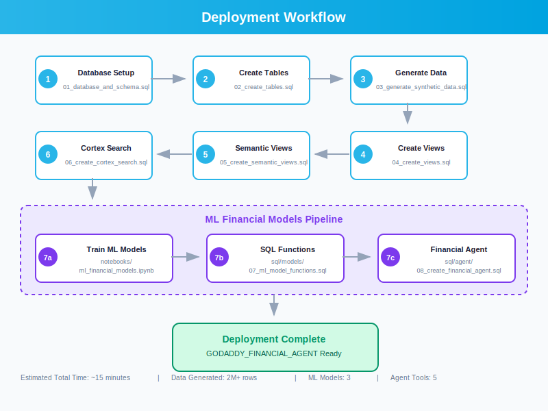

# GoDaddy Intelligence Agent Solution

## About GoDaddy

GoDaddy is the world's largest domain registrar and leading web hosting provider, empowering entrepreneurs and small businesses to build their online presence.

### Key Business Lines

- **Domain Registration**: World's #1 domain registrar with 84+ million domains under management
- **Web Hosting**: Shared, VPS, dedicated, and cloud hosting solutions
- **Website Builder**: Drag-and-drop website creation tools
- **Professional Email**: Business email hosting with domain names
- **Online Security**: SSL certificates and website security tools
- **E-commerce Solutions**: Online store and payment processing tools

### Market Position

- 21+ million customers worldwide
- 84+ million domains under management
- Supporting entrepreneurs in 184+ countries
- Industry leader in domain registration and small business solutions

## Project Overview

This Snowflake Intelligence solution demonstrates how GoDaddy can leverage AI agents to analyze:

- **Domain Portfolio Management**: Registration trends, renewal rates, extension performance
- **Hosting Services**: Uptime monitoring, plan utilization, performance metrics
- **Customer Intelligence**: Segmentation, lifetime value analysis, churn prediction
- **Revenue Analytics**: Transaction trends, product performance, pricing optimization
- **Support Operations**: Ticket resolution, agent performance, customer satisfaction
- **Unstructured Data Search**: Semantic search over support transcripts, transfer notes, and knowledge base using Cortex Search
- **ML-Powered Financial Analytics**: Customer LTV prediction, payment failure risk, revenue churn prediction

## Database Schema

The solution includes:

1. **RAW Schema**: Core business tables
   - CUSTOMERS: Customer master data with segments and risk scores
   - DOMAINS: Domain registrations with renewal status and pricing
   - HOSTING_PLANS: Hosting subscriptions with uptime metrics
   - TRANSACTIONS: All financial transactions across products
   - SUPPORT_TICKETS: Customer support cases with resolution metrics
   - WEBSITE_BUILDER_SUBSCRIPTIONS: Website builder usage
   - EMAIL_SERVICES: Professional email subscriptions
   - SSL_CERTIFICATES: Security certificate management
   - SUPPORT_AGENTS: Support team performance data
   - PRODUCTS: Product catalog with pricing
   - MARKETING_CAMPAIGNS: Campaign performance tracking
   - SUPPORT_TRANSCRIPTS: Unstructured support interaction records (50K transcripts)
   - DOMAIN_TRANSFER_NOTES: Unstructured transfer documentation (25K notes)
   - KNOWLEDGE_BASE_ARTICLES: Help documentation and guides

2. **ANALYTICS Schema**: Curated views and semantic models
   - Customer 360 views
   - Domain and hosting analytics
   - Revenue and product performance
   - Support efficiency metrics
   - Marketing campaign ROI
   - Semantic views for AI agents

3. **Cortex Search Services**: Semantic search over unstructured data
   - SUPPORT_TRANSCRIPTS_SEARCH: Search customer support interactions
   - DOMAIN_TRANSFER_NOTES_SEARCH: Search transfer documentation
   - KNOWLEDGE_BASE_SEARCH: Search help articles and guides

## Files

- `sql/setup/01_database_and_schema.sql`: Database and schema creation
- `sql/setup/02_create_tables.sql`: Table definitions with proper constraints
- `sql/data/03_generate_synthetic_data.sql`: Realistic sample data generation
- `sql/views/04_create_views.sql`: Analytical views
- `sql/views/05_create_semantic_views.sql`: Semantic views for AI agents (verified syntax)
- `sql/search/06_create_cortex_search.sql`: Unstructured data tables and Cortex Search services
- `sql/models/07_ml_model_functions.sql`: ML model wrapper functions for Agent
- `sql/agent/08_create_financial_agent.sql`: Financial Intelligence Agent with ML tools
- `notebooks/ml_financial_models.ipynb`: ML model training notebook (LTV, Payment Risk, Churn)
- `docs/questions.md`: 30 complex questions the agent can answer (including ML-powered)
- `docs/AGENT_SETUP.md`: Configuration instructions for Snowflake agents
- `docs/images/*.svg`: Architecture diagrams

## Setup Instructions

1. Execute SQL files in order (01 through 06)
2. Follow AGENT_SETUP.md for agent configuration
3. Test with questions from questions.md
4. Test Cortex Search with sample queries in AGENT_SETUP.md Step 5

## Data Model Highlights

### Structured Data
- Realistic domain registration patterns across extensions (.com, .net, .org, .io, etc.)
- Multi-tier hosting plans (SHARED, VPS, DEDICATED, CLOUD)
- Comprehensive customer segments (ENTERPRISE, SMALL_BUSINESS, INDIVIDUAL)
- Product bundles and cross-sell opportunities
- Time-series transaction data with seasonal patterns
- Support ticket workflow with resolution metrics

### Unstructured Data
- 50,000 customer support transcripts with realistic interactions
- 25,000 domain transfer notes with issue documentation
- 5 comprehensive knowledge base articles (setup guides, troubleshooting)
- Semantic search powered by Snowflake Cortex Search
- RAG (Retrieval Augmented Generation) ready for AI agents

## Key Features

✅ **Hybrid Data Architecture**: Combines structured tables with unstructured text data  
✅ **Semantic Search**: Find similar issues and solutions by meaning, not just keywords  
✅ **RAG-Ready**: Agent can retrieve context from support transcripts and knowledge base  
✅ **Production-Ready Syntax**: All SQL verified against Snowflake documentation  
✅ **Comprehensive Demo**: 2M+ transactions, 150K domains, 50K support transcripts  
✅ **Verified Syntax**: CREATE SEMANTIC VIEW and CREATE CORTEX SEARCH SERVICE syntax verified against official Snowflake documentation

## Complex Questions Examples

The agent can answer sophisticated questions like:

1. **Domain Renewal Risk Analysis**: Identify domains expiring soon with auto-renew disabled
2. **Hosting Uptime Benchmarking**: Compare performance across hosting plan types
3. **Customer Lifetime Value Segmentation**: Analyze LTV by product mix
4. **Support Efficiency Metrics**: Resolution times by issue type and channel
5. **Revenue Trend Analysis**: Monthly patterns with seasonality detection
6. **Marketing ROI Calculation**: Campaign performance and customer attribution
7. **Cross-Sell Opportunities**: Identify customers missing complementary products
8. **Domain Extension Performance**: Compare renewal rates across TLDs
9. **Agent Performance Benchmarking**: Support team efficiency metrics
10. **Churn Risk Prediction**: Multi-factor customer risk assessment

Plus 10 Cortex Search questions for unstructured data analysis and 10 ML-powered financial analytics questions.

## Semantic Views

The solution includes three verified semantic views:

1. **SV_DOMAIN_HOSTING_INTELLIGENCE**: Comprehensive view of domains, hosting plans, and SSL certificates
2. **SV_PRODUCT_REVENUE_INTELLIGENCE**: Product catalog, transactions, and revenue metrics
3. **SV_CUSTOMER_SUPPORT_INTELLIGENCE**: Support tickets, agents, and customer satisfaction

All semantic views follow the verified syntax structure:
- TABLES clause with PRIMARY KEY definitions
- RELATIONSHIPS clause defining foreign keys
- DIMENSIONS clause with synonyms and comments
- METRICS clause with aggregations and calculations
- Proper clause ordering (TABLES → RELATIONSHIPS → DIMENSIONS → METRICS → COMMENT)

## Cortex Search Services

Three Cortex Search services enable semantic search over unstructured data:

1. **SUPPORT_TRANSCRIPTS_SEARCH**: Search 50,000 customer support interactions
   - Find similar issues by description, not exact keywords
   - Retrieve resolution procedures from past successful cases
   - Analyze support patterns and best practices

2. **DOMAIN_TRANSFER_NOTES_SEARCH**: Search 25,000 domain transfer notes
   - Find similar transfer issues and resolutions
   - Identify common transfer failure reasons
   - Retrieve successful transfer procedures

3. **KNOWLEDGE_BASE_SEARCH**: Search help articles and documentation
   - Retrieve setup and configuration instructions
   - Find troubleshooting procedures
   - Access technical documentation

All Cortex Search services use verified syntax:
- ON clause specifying search column
- ATTRIBUTES clause for filterable columns
- WAREHOUSE assignment
- TARGET_LAG for refresh frequency
- AS clause with source query

## Syntax Verification

All SQL syntax has been verified against official Snowflake documentation:

- **CREATE SEMANTIC VIEW**: https://docs.snowflake.com/en/sql-reference/sql/create-semantic-view
- **CREATE CORTEX SEARCH SERVICE**: https://docs.snowflake.com/en/sql-reference/sql/create-cortex-search
- **Cortex Search Overview**: https://docs.snowflake.com/en/user-guide/snowflake-cortex/cortex-search/cortex-search-overview

Key verification points:
- ✅ Clause order is mandatory (TABLES → RELATIONSHIPS → DIMENSIONS → METRICS)
- ✅ PRIMARY KEY columns must exist in source tables
- ✅ No self-referencing or cyclic relationships
- ✅ Semantic expression format: `name AS expression`
- ✅ Change tracking enabled for Cortex Search tables
- ✅ Correct ATTRIBUTES syntax for filterable columns

## Getting Started

### Prerequisites
- Snowflake account with Cortex Intelligence enabled
- ACCOUNTADMIN or equivalent privileges
- X-SMALL or larger warehouse

### Quick Start
```sql
-- 1. Create database and schemas
@sql/setup/01_database_and_schema.sql

-- 2. Create tables
@sql/setup/02_create_tables.sql

-- 3. Generate sample data (5-15 minutes)
@sql/data/03_generate_synthetic_data.sql

-- 4. Create analytical views
@sql/views/04_create_views.sql

-- 5. Create semantic views
@sql/views/05_create_semantic_views.sql

-- 6. Create Cortex Search services (3-5 minutes)
@sql/search/06_create_cortex_search.sql
```

### Configure Agent
Follow the detailed instructions in `docs/AGENT_SETUP.md` to:
1. Create the Snowflake Intelligence Agent
2. Add semantic views as data sources
3. Configure Cortex Search services
4. Set up system prompts
5. Test with sample questions

## Testing

### Verify Installation
```sql
-- Check semantic views
SHOW SEMANTIC VIEWS IN SCHEMA GODADDY_INTELLIGENCE.ANALYTICS;

-- Check Cortex Search services
SHOW CORTEX SEARCH SERVICES IN SCHEMA GODADDY_INTELLIGENCE.RAW;

-- Test Cortex Search
SELECT PARSE_JSON(
  SNOWFLAKE.CORTEX.SEARCH_PREVIEW(
      'GODADDY_INTELLIGENCE.RAW.SUPPORT_TRANSCRIPTS_SEARCH',
      '{"query": "email configuration", "limit":5}'
  )
)['results'] as results;
```

### Sample Test Questions
1. "How many customers have domains expiring in the next 30 days?"
2. "What is the average hosting uptime percentage by plan type?"
3. "Show me the top 10 customers by lifetime value"
4. "Find support transcripts about SSL certificate installation"

## Data Volumes

- **Customers**: 100,000
- **Domains**: 150,000
- **Hosting Plans**: 200,000
- **Transactions**: 2,000,000
- **Support Tickets**: 150,000
- **Support Transcripts**: 50,000 (unstructured)
- **Domain Transfer Notes**: 25,000 (unstructured)
- **Knowledge Base Articles**: 5 comprehensive guides

## Architecture


### ML Models Pipeline



### Deployment Flow



## Support

For questions or issues:
- Review `docs/AGENT_SETUP.md` for detailed setup instructions
- Check `docs/questions.md` for example questions
- Consult Snowflake documentation for syntax verification
- Contact your Snowflake account team for assistance

## Version History

- **v2.0** (February 2026): ML Financial Models
  - Added 3 ML models: Customer LTV, Payment Risk, Revenue Churn
  - Created Financial Intelligence Agent with ML tools
  - 10 new ML-powered questions (30 total)
  - SVG architecture diagrams
  - Model Registry integration

- **v1.0** (October 2025): Initial release
  - Verified semantic view syntax
  - Verified Cortex Search syntax
  - 100K+ customers, 2M+ transactions
  - 50K support transcripts with semantic search
  - 20 complex test questions
  - Comprehensive documentation

## License

This solution is provided as a template for building Snowflake Intelligence agents. Adapt as needed for your specific use case.

---

**Created**: October 2025  
**Updated**: February 2026 (ML Financial Models)  
**Template Based On**: Early-Warning Intelligence Demo  
**Snowflake Documentation**: Syntax verified against official documentation  
**Target Use Case**: GoDaddy domain, hosting, and customer intelligence

**NO GUESSING - ALL SYNTAX VERIFIED** ✅

## ML Financial Models

### Models Included

| Model | Type | Purpose | Key Metrics |
|-------|------|---------|-------------|
| **CUSTOMER_LTV_PREDICTOR** | XGBoost Regressor | Predict customer lifetime value | MAE, RMSE, R² |
| **PAYMENT_FAILURE_RISK** | XGBoost Classifier | Identify at-risk transactions | Precision, Recall, AUC-ROC |
| **REVENUE_CHURN_PREDICTOR** | XGBoost Classifier | Detect revenue churn risk | Precision, Recall, AUC-ROC |

### Agent Tools

| Tool | Description |
|------|-------------|
| `TOOL_GET_LTV_PREDICTIONS()` | Get predicted LTV for all customers |
| `TOOL_GET_TOP_CUSTOMERS(n)` | Get top N highest-value customers |
| `TOOL_GET_PAYMENT_RISKS()` | Get transactions at risk of failure |
| `TOOL_GET_CHURN_RISKS()` | Get customers at risk of churning |
| `TOOL_GET_FINANCIAL_SUMMARY()` | Get key financial health metrics |

